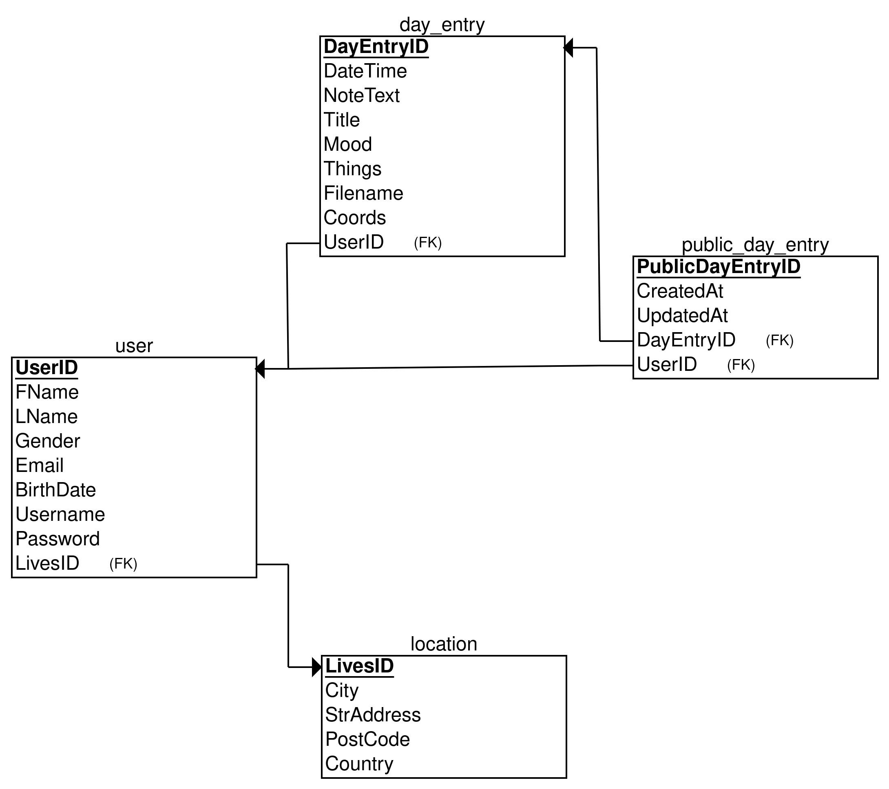
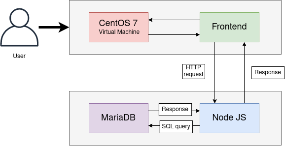

# DiaryKeeper App / Vanilla JS / Node JS

## Description
Instead of using Dialogflow and Firebase database I had decided to use MongoDB, React and Heroku to publish the app. 
NodeJS uses a RESTful API endpoint to receive a request body. Request body is forwarded to HeadAI's API. 
Response is validated and notification message is displayed to the user in front-end. Axios library is used to post a request.

### Uusien päivien luonti || Haluaisin ottaa täst vastuun —Michael
Käyttäjä pitäisi pystyä merkitsemään uuden päivän päiväkirjaansa painamalla lisäysnappulaa oikeassa yläkulmassa.
Vie uudelle sivulle, jonka formiin täytetään seuraavat tiedot
<ul>
  <li>Otsikko</li>
  <li>Päivämäärä ja aika</li>
  <li>Fiilis</li>
  <li>Valitseman päivän tekemiset, esim. ollut perheen tai kavereiden kaa, rentoutumista jne.</li>
  <li>Tekstikenttä muistiinpanoille</li>
</ul>

## Getting Started
These instructions should get you started on running this project on your local or virtual machine for development or testing purposes.

### Prerequisites
To get started you need:
<ul>
  <li>A computer</li>
  <li>Connection to the internet</li>
  <li>Your favorite code editor that suits your web development needs</li>
  <li>Server for production (we used LAMP stack)</li>
</ul>

### Usage
I've provided instructions on how to use this software for localhost or server use.


#### Local computer
<details><summary>Show instructions</summary>
1. Open project in code editor.
  <br/>
2. Change branch to loginPage4 in project with git:
  
```sh 
  $ git checkout loginPage4
```
<br/>
3. Install node module packages:

```sh 
$ npm i
```
<br/>
4. To configure your MariaDB/MySQL database among other things you need to create a .env file and create the following variables:

```sh 
DB_HOST=(e.g. mysql.me.../root/etc.)
DB_USER=(e.g root)
DB_PASS=(DB_USER PASSWORD!)
DB_NAME=(Name of database)
TOKEN=(For JsonWebToken)

PORT=(Port that app uses)
```
<br/>
5. Start Node JS app

```sh 
$ npm run dev
```
<br/>
or 

```sh 
$ node app.js
```
<br/>
</details>

#### Server computer
<details><summary>Show instructions</summary>
Following instructions might not work or be needed depending what you might be using
<br/>
1. Open project in code editor.
<br/>
2. You should be in master branch. If not, you can try this git command:

```sh 
  $ git checkout master
```
</br>
  
3. Install node module packages:
```sh 
$ npm i
```
<br/>
5. You should change all <strong>url</strong> variables in frontend JS files to your server IP address.
<br/>
4. To configure your MariaDB/MySQL database among other things you need to create a .env file and create the following variables:

```sh 
DB_HOST=(usually localhost)
DB_USER=(e.g root)
DB_PASS=(DB_USER PASSWORD!)
DB_NAME=(Name of database)
TOKEN=(For JsonWebToken)

PORT=(Port that app uses)
NODE_ENV=development/production # Production for server side
PROXY_PASS=(If you're using proxy pass)
```

<br/>
3. Start Node JS app in your server.

```sh 
$ npm run dev
```

or 

```sh 
$ node app.js
```

</details>

### Diagrams
Here is an ER diagram of how the entities are related to each other and what kind of data is stored in the database.
<p align = "center">

</p>

Diagram that demonstrates what goes on in the background when the user interacts with this software.
<p align = "center">

</p>

### Change log
See CHANGELOG [here](CHANGELOG.md)
