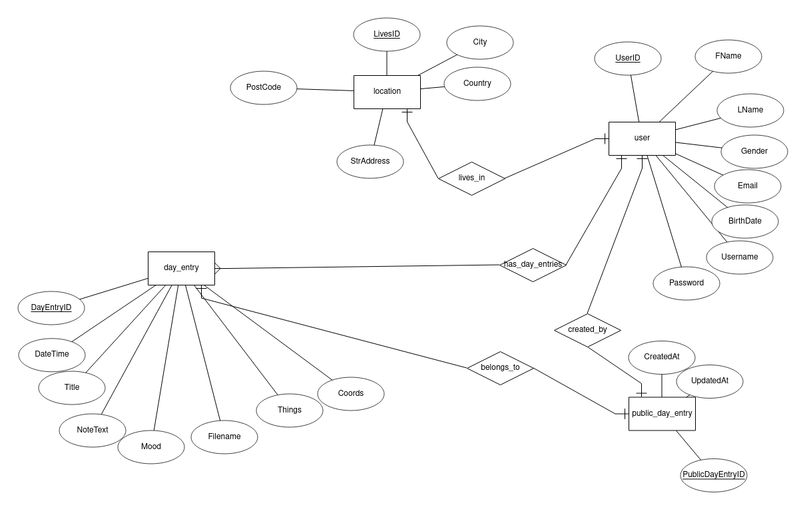

# DiaryKeeper App / Vanilla JS / Node JS

## Description
Instead of using Dialogflow and Firebase database I had decided to use MongoDB, React and Heroku to publish the app. 
NodeJS uses a RESTful API endpoint to receive a request body. Request body is forwarded to HeadAI's API. 
Response is validated and notification message is displayed to the user in front-end. Axios library is used to post a request.

### Uusien päivien luonti || Haluaisin ottaa täst vastuun —Michael
Käyttäjä pitäisi pystyä merkitsemään uuden päivän päiväkirjaansa painamalla lisäysnappulaa oikeassa yläkulmassa.
Vie uudelle sivulle, jonka formiin täytetään seuraavat tiedot
<ul>
  <li>Otsikko</li>
  <li>Päivämäärä ja aika</li>
  <li>Fiilis</li>
  <li>Valitseman päivän tekemiset, esim. ollut perheen tai kavereiden kaa, rentoutumista jne.</li>
  <li>Tekstikenttä muistiinpanoille</li>
</ul>

## Getting Started
These instructions will get you a copy of the project up and running on your local machine for development and testing purposes.

### Prerequisites
To get started you need a computer, internet connection (for API) and your favourite code editor. I used VS Code, but you can use Webstorm or whichever you're comfortable with.

### Usage
Clone or download this repo to your local machine.
<details><summary>Show instructions</summary>

1. Open project in code editor.

2. Install node_module packages:
```sh 
$ npm install
```

3. Start backend server from terminal:
```sh 
$ npm run dev
```
4. Launch a second terminal and navigate to client directory and run:
```sh 
$ npm start
```

</details>

### Diagram
Here is an ER diagram of how the entities are related to each other and what kind of data is stored in the database.
<p align = "center">

</p>

### Change log
See CHANGELOG [here](CHANGELOG.md)
